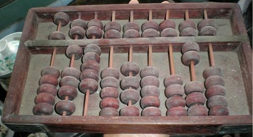
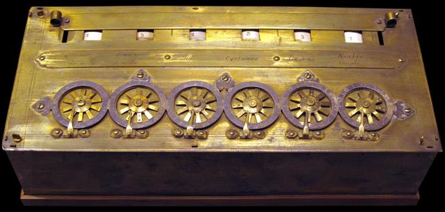
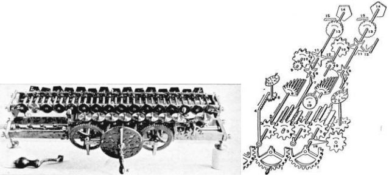
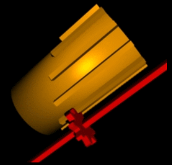

> 看完 0.1 节的内容后，想必你已经初步了解了计算机的“组成”与“构成”。那么接下来一个很自然的问题便是，计算机是如何发展到今天的形式，其中的设计原理又在何处呢？相信本节关于历史发展的介绍会给你比较满意的答案。

# 0.2  历史的观点看计算机系统

## 0.2.1  故事的开始——探索机器解决问题的方案

### 0.2.1.1  初步的尝试——从非自动化计算工具开始

看到 0.2.1 节的标题，你或许会想起已有两千多年历史的**算盘**（如图 1-1）。的确，这一中国古人智慧的结晶在是可以帮助人简化并加快计算的步骤的“计算工具”。然而，“计算机器”是需要非人力方式实现自动化操作的，算盘在这一方面则无法实现了。

将目光看向古代西方文明。1900 年，潜水员在安迪基提腊岛附近发现一个青铜器具，上有齿轮和刻度盘，是公元前 65 年左右古希腊人用来计算天体运行的工具。意大利的庞培城，公元 79 年被火山岩浆湮没，直到 20 世纪才大白于世，在遗物中发现罗马时代的**比例规**。这些都是古代计算工具的实物。

或许与文艺复兴的思潮有关，欧洲人在这时开始逐渐深入了对于机器解决问题方案的探索。大量机械重复的计算问题困扰着人们，但同时也成为了人们发明计算机器解决计算问题的一大动力。

首先需要介绍的，也并非完全自动的计算机器——**计算尺**。这是一种类似于算盘，但是能实现更多功能（如求根、指对数、三角函数等）的计算工具，但是也缺少了自动化的能力。

计算尺的思想来源于约翰·纳皮尔——对数的发明者。对数发明以后，乘除运算可以化为加减运算，利用这一特点，可制成对数计算尺，其使用示例如图 1-2 所示。

> 约翰·纳皮尔（John Napier，1550-1617），苏格兰数学家、神学家，对数的发明者。那时天文学家 Tycho Brahe（第谷，1546～1601）等人做了很多的观察，需要很多的计算，而且要算几个数的连乘，因此苦不堪言。1594 年，纳皮尔为了寻求一种球面三角计算的简便方法，运用了独特的方法构造出对数方法。1614 年 6 月在爱丁堡出版的第一本对数专著《奇妙的对数表的描述》（"Mirifici logarithmorum canonis descriptio"）中阐明了对数原理，后人称为纳皮尔对数：Nap logX。

最早将纳皮尔的理论转化为实物的是英国的 E·冈特，他设计的计算尺以后经多次的改进，才成为现代的计算尺。几次大的进步是：1632 年 W·奥特雷德发明有滑尺的计算尺，同时造出圆形计算尺。1652 年 R·比萨克、1657 年 S·帕特里奇制造有固定尺身和滑尺的计算尺。1850 年法国的曼南将游标装在尺上，被广泛采用。在计算尺的发展历程中，算尺的形状也从直尺多样化为圆尺、柱状算尺，“倒数刻度”等其他刻度被逐步引入，产生了“多相”算尺。除此之外，除了乘除法计算外的求根式、指对数、三角函数等运算也逐步引入计算尺的功能。

20 世纪 50-60 年代，计算尺是工程师身份的象征，如同显微镜代表医学行业一样。有些工程系的学生和工程师常把10-英寸算尺别在皮带上，或者把一把10-或20-英寸算尺安放在家中或办公室里做精确运算用。然而，非自动化的局限性还是使得计算尺逐渐淡出历史舞台，袖珍科学计算器（即带有三角和对数函数的计算器）的诞生为计算尺敲响了最后的丧钟。

### 0.2.1.2  自动化计算工具的开端——机械计算器的设计

算盘、计算尺等计算工具终究离不开人的控制与调节。如何将输入送入机器后，能不需要人的调控便可以获得需要的输出，这才真正实现了机器解决问题的理想。

令人兴奋的是，一个天才少年——布莱士·帕斯卡的出现打开了自动化计算工具设计的大门。为了帮助父亲计算大量的税率税款，他想到了要为父亲制造一台会计算的机器。他根据数的十进位制，通过齿轮的比来解决进位问题——低位的齿轮每转动 10 圈，高位上的齿轮只转动一圈，并采用精密的机械原理解决计算和自动进位的问题。终于，在1642 年，19 岁的帕斯卡获得了成功，他称这架小小的机器为“**加法器**”，尽管这台机械式计算机的设计原理完全正确，可它在机械方面还有不少缺陷。

> 布莱士·帕斯卡（Blaise Pascal，1623-1662），法国数学家、物理学家、哲学家、散文家。他 16 岁时发现著名的帕斯卡六边形定理，17 岁时写成的《圆锥曲线论》是自希腊阿波罗尼奥斯（Apollonius of Perga）以来圆锥曲线论的最大进步。1642 年，他设计并制作了一台能自动进位的加减法计算装置，被称为是世界上第一台数字计算器。1654 年他开始研究几个方面的数学问题，在无穷小分析上深入探讨了不可分原理，得出求不同曲线所围面积和重心的一般方法，并以积分学的原理解决了摆线问题，于 1658 年完成《论摆线》。他的论文手稿对莱布尼茨（Gottfried Leibniz）建立微积分学有很大启发。在研究二项式系数性质时，给出的二项式系数展开后人称为“帕斯卡三角形”。他还制作了水银气压计，写了液体平衡、空气的重量和密度等方向的论文。自 1655 年隐居修道院，写下《思想录》（1658）等经典著作。

经过努力，帕斯卡又制成了一台机械式计算机。这台机械式计算机像一个盒子，外壳用黄铜制成。它长 20 英寸、宽 4 英寸、高 3 英寸。机器顶部是一块黄铜板，上面有一排圆孔，通过它可以看见底下的圆环。孔数和圆环数为8个，每个圆环可以围绕自己的圆心旋转。圆环上有很多长齿。右面第一个圆环有 12 个齿，第二个有 20 个齿，而其余各有 10 个。由于设计目的是为算账用的，因此这些齿适合当时法国零钱的换算：1 利维尔＝20 苏；1 苏＝12 尖野。自然，所有其他的圆环都可以以苏为单位处理货币，也可以处理数据。

这种机器开始只能够做 6 位加法和减法，做乘法时必须用连加的方法；做除法时，也只能用连减的方法。而且使用时需用一个小钥匙拨动一下，方可计算；每次计算完毕，都必须复原到零位，下次方可计算。然而，即使只做加法，也有个“逢十进一”的进位问题。帕斯卡采用了一种小爪子式的棘轮装置。当定位齿轮朝 9 转动时，棘爪便逐渐升高；一旦齿轮转到 0，棘爪就“咔嚓”一声跌落下来，推动十位数的齿轮前进一档。

帕斯卡去世十年后，德国数学家莱布尼茨发现了一篇由帕斯卡亲自撰写的“加法器”论文。这勾起了他强烈的发明欲望，决心把这种机器的功能扩大为乘除运算。他在帕斯卡加、减法机械计算机的基础上进行改进，发明了一款更先进的计算器。

> 戈特弗里德·威廉·莱布尼茨（Gottfried Wilhelm Leibniz，1646－1716），德国哲学家、数学家，是历史上少见的通才，被誉为十七世纪的亚里士多德。他本人是一名律师，经常往返于各大城镇，他许多的公式都是在颠簸的马车上完成的，他也自称具有男爵的贵族身份。
> 
> 莱布尼茨在数学史和哲学史上都占有重要地位。在数学上，他和艾萨克·牛顿先后独立发现了微积分，而且他所使用的微积分的数学符号被更广泛的使用。莱布尼茨还发现并完善了二进制。在哲学上，莱布尼茨的乐观主义最为著名，他和笛卡尔、巴鲁赫·斯宾诺莎被认为是十七世纪三位最伟大的理性主义哲学家。

莱布尼茨发明的机器叫“**乘法器**”，该机器长约 67 厘米，图1-4展示了其外部整体构造与内部设计细节。这款计算器设有一个镶有 9 个不同长度齿轮的圆柱，整体由两个部分组成：第一部分是固定的，用于加减法，与帕斯卡先前设计的加法机基本一致；第二部分用于乘除法，这部分是他专门设计的乘法器和除法器，由两排齿轮构成（被乘数轮与乘数轮），这是莱布尼茨首创的。这架计算机中的许多装置成为后来的技术标准，称为“莱布尼茨轮”。我们主要关心乘、除法器部分。它由两个相连的部分组成：其一是位于后方的可以容纳 16 位十进制数字的累加器，位于前方的第二部分包括一个 8 位数字的输入部分。输入部分有 8 个带旋钮的拨盘，用于设置操作数。输入部分右侧有一个类似电话的拨盘用于设置乘数，前方的曲柄则用于进行计算。运算结果显示在后方累加器的 16 个窗口中。输入部分安装在导轨上，可以沿着累加器部分移动，以改变操作数数字与累加器数字的对齐方式（我们很快便会发现这种设计的目的）。还有一个十进位指示器和一个将机器设置为零的控件。这架机器可进行乘、除法的演算，样机达到了可以进行四则运算的水平。

这台机器的总体设计思路是通过反复加法进行乘法，通过反复减法进行除法。要乘以一位数 0-9，首先将被乘数放在输入部分，然后将旋钮形手写笔插入类似电话的拨盘的相应孔中以设置乘数，然后转动曲柄，乘法器表盘顺时针旋转，机器为每个孔执行一次加法，直到手写笔在表盘顶部停下来。结果出现在累加器窗口中。由此可见，乘以一位数的实现方式是将被乘数累加乘数次。

当乘以一个多位数时，从最低位开始进行一位数乘法操作，当一位计算结束后，我们将输入部分（即乘数）左移——现在你应该理解将输入部分放置在导轨上的原因了，这与竖式乘法的方式完全对应——然后再重复一位数乘法的操作即可。

用减法实现除法的过程也并不难理解。我们将被除数设置在累加器中，除数设置在输入部分中。然后我们移动输入部分直到被除数和除数的左侧数字对齐。转动操作曲柄（与乘法相反，需要将表盘逆时针转动）并重复从累加器中减去除数，直到累加器结果的最高位数字为0。乘数刻度盘上显示的数字就是商的第一个数字。然后将输入部分右移一位（回忆竖式除法的方式）。重复以上减数、移位步骤，得到商的每一位即可。

或许大家对加减法次数控制的模块感兴趣，那么我们略微展开说明一下。如图1-5所示，莱布尼茨为计算机增添了一种名叫“步进轮”的装置。步进轮是一个有 9 个齿的长圆柱体，9 个齿长度不同，分布于圆柱表面；旁边另有个小齿轮可以沿着轴向移动，从而可以与步进轮上不同数量的齿啮合。每当小齿轮转动一圈，步进轮可根据它与小齿轮啮合的齿数，转动 1/10 或 2/10 圈……，最多可以转动 9/10 圈，这样就能控制它连续重复地做加减法的次数。

帕斯卡的计算机经由莱布尼茨的改进之后，人们又给它装上电动机以驱动机器工作，成为名符其实的“电动计算机”，并且一直使用到 20 世纪 20 年代才退出舞台。然而，一台仅能实现四则运算的机器无法满足人们对于机器解决更多问题的需求，还需等待更伟大的构想。

#### 0.2.1.3  超前的伟大构想——从巴贝奇的差分机到分析机

莱布尼茨发明乘法器后的一百余年中，人类关于计算机器的设想大多停滞在对于乘法器的改进上。然而，这些越来越精密的仪器却仅仅和加、减、乘、除——简单到不能再简单的基本运算打交道。难道机器只能用来做运算吗？为了解决一个数学问题，人们往往需要将多步运算串联起来，每一次串联不过是将上一步的运算结果直接或经过简单处理后交给下一步而已，而既然运算可以由机器完成，为什么步骤就不可以呢？

伟大的设想仍然来自于社会的背景，1789 年法国大革命后，君主制被推翻，新成立的国民议会大刀阔斧地推行着多方改革，其中一项很重要的工作就是统一全国混乱不堪的度量衡，与此同时，原本的数学用表不再适用，需要重新编制。

表的规模十分庞大，计算结果需要精确到小数点后 14～29 位，工作量的巨大可想而知。这项艰巨的任务落在了数学家加斯帕德·德普罗尼（Gaspard de Prony）肩上，他进行了层次分明的分工，并且要求所有数据至少运算两遍——甚至于要求是不同地点不同方法运算两遍，于是他自信宣称“制作数学用表可以像生产针一样简单”。然而，成表的正确率并不尽如人意。多年以后的英国，巴贝奇和约翰·赫歇尔也承担着类似的制表任务。他深入调研了这位前辈的工作，了解到正确率的保障有多困难。他们尝试了各种减少错误的手段，比如调整纸张和墨水的颜色以提高数字的识别度，比如直接拿现有多个版本的表进行誊抄、比对、让不同人员反复校对，结果却依然不尽人意。

于是巴贝奇意识到：只要是人为的，就没有完美的。他思忖着：人类最容易出错的部分，特别是大量机械重复的计算的部分，可否用机器来代替呢？1822年6月14日，巴贝奇向皇家天文学会递交了一篇名为《论机械在天文及数学用表计算中的应用》的论文，差分机的概念正式问世。与论文一起亮相的，是一台简单的原型机——**差分机**0号。英国政府对它很有兴趣，并于次年拨款1700英镑，希望巴贝奇能做出实用产品，彻底解决制表难题。

> 查尔斯·巴贝奇（Charles Babbage，1791年12月26日—1871年10月18日 \[1]  ）是一名英国发明家，科学管理的先驱者，出生于一个富有的银行家的家庭，曾就读于剑桥大学三一学院。
> 
> 他的贡献主要有以下几点：提出了在科学分析的基础上的可能测定出企业管理的一般原则。设计出世界上第一台计算机——于 1823 年设计出来的世界上第一台计算机小型差数机，虽然没有制成，但其基本原理于 92 年后被应用于巴勒式会计计算机。他还利用计数机来计算工人的工作数量、原材料的利用程度等。他制定了一种“观察制造业的方法”。这种方法同后来别人提出的“作业研究的科学的、系统的方法”非常相似。他进一步发展了亚当·斯密关于劳动分工的利益的思想，分析了分工能提高劳动生产率的原因。

于是巴贝奇开始着手于差分机一号（Difference Engine No.1）的设计。简单来说，差分机就是一台多项式求值机，只要将多项式方程_F_(_x_)的前3个初始值（如_F_(0)、_F_(1)、_F_(2)）输入到机器里，机器每运转一轮，就能产生出多项式后续的一个值。其计算方法来源于帕斯卡在1654年提出的差分思想：_n_次多项式的_n_次数值差分为同一常数。这句话十分抽象，概括性高，我们用几个例子来详细说明。

给定，同时定义差分，则列出表格如下：

| _x_                                                                  | 0 | 1  | 2  | 3  | 4  | 5  | 6  |
| -------------------------------------------------------------------- | - | -- | -- | -- | -- | -- | -- |
| _F_(_x_)                                                             | 6 | 11 | 16 | 21 | 26 | 31 | 36 |
|   | 5 | 5  | 5  | 5  | 5  | 5  |    |

表1-1  的差分表

不难发现，对于一次多项式，每个相邻的_x_所对应的_F_(_x_)之差都是一个常数.对于二次多项式呢？以_F_(_x_)= _x_²+4为例，我们同时定义一阶差分

&#x20;

和二阶差分

&#x20;

列出表格如下：

| _x_                                                                  | 0 | 1 | 2 | 3  | 4  | 5  | 6  |
| -------------------------------------------------------------------- | - | - | - | -- | -- | -- | -- |
| _F_(_x_)                                                             | 4 | 5 | 8 | 13 | 20 | 29 | 40 |
|   | 1 | 3 | 5 | 7  | 9  | 11 |    |
|   | 2 | 2 | 2 | 2  | 2  |    |    |

表1-2  的差分表

我们可以发现，对于二次多项式，每个相邻的_x_所对应的一阶差分之差（即二阶差分）是一个常数。依此类推，_n_次多项式的_n_次数值差分为同一常数便可以理解了。

基于这一定理，我们便可以实现差分机的功能。给定差分机以多项式的初始值_F_(1)=5、_F_(2)=8、_F_(3)=13，计算得到的二阶差分为常数2。我们可以从此处开始往前推算回去，接下来的每一个值，就是将高阶差分和低一阶的对应差分相加，不断重复直至加到原多项式为止。例如求_F_(4)时，先将第二阶差2加上第一阶对应差分5得到7，再将7加上_F_(3)的值13，就会得到_F_(4)=20。以此类推，求出多项方程式的结果完全只需要用到加法与减法，并且不断重复的特性却很适合机械运算。

差分机的重要意义在于，由于许多常见的函数都可以用多项式逼近（幂级数展开），如常用的三角函数、对数函数都可以转换为多项式。借助差分思想，这些函数值的求解可以进一步转换为重复的加法。这样一来，绝大部分数学运算就都可以交给机器了。

差分的思想或许不难理解，但是将这一思想转化为机械，则是有一定的困难的。幸运的事，巴贝奇凭借其智慧构造了完美的设计图，但不幸的是，因为机械制造技术的限制，大量精密零件制造困难，加上巴贝奇不停地边制造边修改设计，从1822到1832年的十年间，巴贝奇只能拿出完成品的1/7——一台支持6位数、2次差分的小模型（设计稿为20位数、6次差分）来展示。巴贝奇不断延后完成期限的严重超支（英国政府在1842年的最后清算发现整个计划一共让国库支出了￡17,500）、制作过程不断修改设计、时常与总工程师克里门发生冲突等诸多原因，让完整的差分机一号一直未能完成，一万两千多个还没用到的精密零件后来都被熔解报废。
